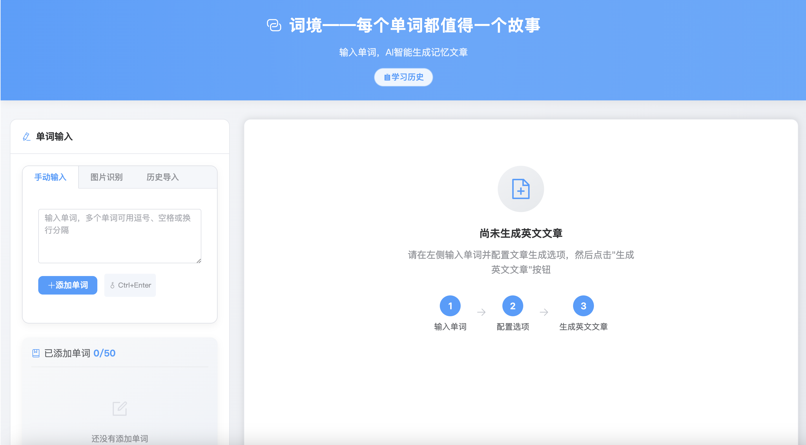
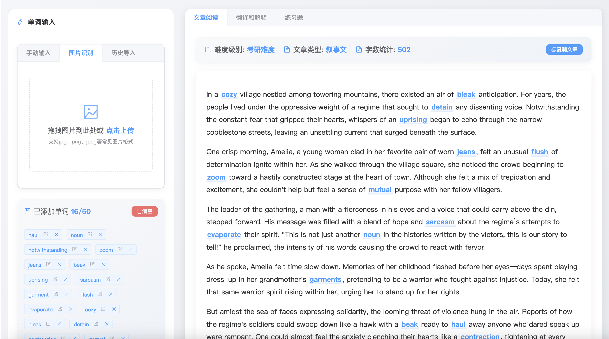
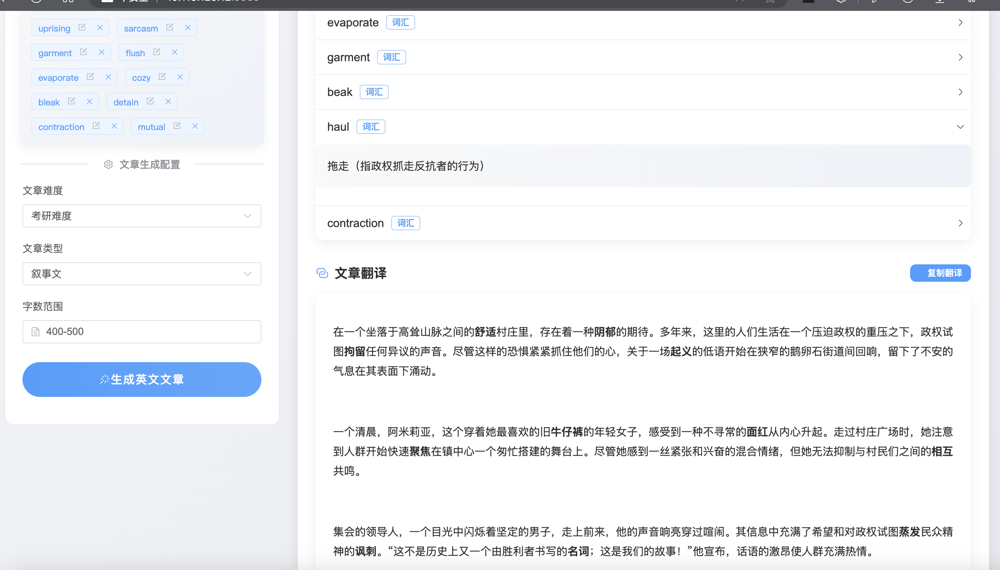
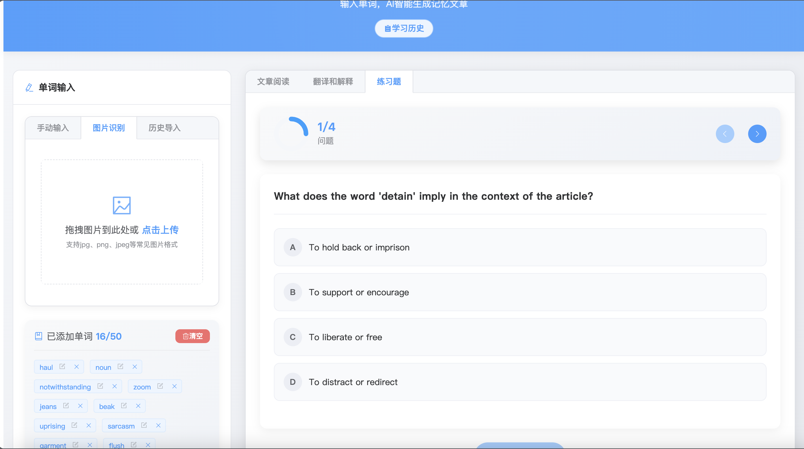

# VocabVerse 词境 
每一个单词都值得一个故事
## 目录

- [VocabVerse 词境 ](#vocabverse-词境-)
  - [目录](#目录)
  - [介绍](#介绍)
    - [核心功能](#核心功能)
    - [技术架构](#技术架构)
  - [安装方法](#安装方法)
    - [前置要求](#前置要求)
    - [部署步骤](#部署步骤)
  - [使用指南](#使用指南)
  - [贡献指南](#贡献指南)
  - [问题反馈](#问题反馈)
  - [进一步计划](#进一步计划)
  - [协议](#协议)
## 介绍

VocabVerse（词境）是一个基于大语言模型（LLM）的英语词汇学习工具，通过LLM生成包含用户指定单词的英文文章，帮助学习者在上下文中理解和记忆英语单词。

### 核心功能

- **智能文章生成**：输入单词列表，AI 会生成一篇包含这些单词的连贯英文文章
- **文章难度定制**：可选择不同难度级别（考研、四六级、高中等）和文章类型（议论文、说明文、小说等）
- **翻译与解释**：自动提供文章翻译及单词详细解释
- **练习题生成**：基于文章内容生成相关练习题，帮助加深理解
- **学习记录存储**：自动保存学习历史，方便随时回顾和复习
- **历史记录管理**：浏览、查看和管理以往的学习记录









### 技术架构

- 前端：Vue 3 + Element Plus
- 后端：API服务（支持多种LLM模型）

## 安装方法

### 前置要求

- Git（可选，用于克隆仓库）
- Python 3.10+
- Node.js 18+

### 部署步骤

1. **获取项目代码**

   ```bash
   git clone https://github.com/yourname/VocabVerse.git
   cd VocabVerse
   ```

2. **后端部署**

   1. 配置LLM API信息，目前可选DeepSeek, OpenAI,SiliconFlow

      ```bash
      cd api
      cp .env-copy .env
      vim .env
      ```

      配置信息说明:

      ```txt
      LLM_PROVIDER= # 模型提供商，可选值为 DEEPSEEK、OPENAI 或 SILICONFLOW
      
      # OpenAI 相关配置
      OPENAI_API_KEY= # OpenAI 的 API 密钥，用于身份验证
      OPENAI_BASE_URL= # OpenAI 的 API 请求基础 URL，通常为 https://api.openai.com/v1
      OPENAI_MODEL= # 使用的 OpenAI 模型名称，例如 gpt-4o 或 o3-mini
      
      # DeepSeek 相关配置
      DEEPSEEK_API_KEY= # DeepSeek 的 API 密钥，用于身份验证
      DEEPSEEK_BASE_URL= # DeepSeek 的 API 请求基础 URL
      DEEPSEEK_MODEL= # 使用的 DeepSeek 模型名称，例如 deepseek-chat 或 deepseek-coder
      
      # SiliconFlow 相关配置
      SILICONFLOW_API_KEY= # SiliconFlow 的 API 密钥，用于身份验证
      SILICONFLOW_BASE_URL= # SiliconFlow 的 API 请求基础 URL
      SILICONFLOW_MODEL= # 使用的 SiliconFlow 模型名称，根据实际需求填写

      # Gemini 相关配置
      GEMINI_API_KEY= # Gemini 的 API 密钥，用于身份验证
      GEMINI_MODEL=  # 使用的 Gemini 模型名称，例如 gemini-2.5
      ```

   2. 创建虚拟环境并激活

      ```
      python3 -m venv venv
      source venv/bin/activate # Linux/MacOS
      .\venv\Scripts\activate # Windows
      ```

   3. 安装依赖

      ```bash
      pip3 install -r requirements.txt
      ```

   4. 启动项目

      ```bash
      python3 main.py
      ```


3. 前端部署

   1. 配置后端API地址

      ```bash
      cd web
      cp .env-copy .env
      vim .env
      ```

      说明

      ```txt
      VITE_API_BASE_URL=http://localhost:9988/v1 # 如果是本机使用可以不用修改，如果是服务器，请修改成服务器ip
      ```

    2. 下载依赖并启动

       ```bash
       npm install
       npm run dev
       ```

    3. 部署（可选）

       ```bash
       npm run build
       ```

       然后用niginx反向代理
## 使用指南

1. 打开浏览器访问前端地址（默认为 http://localhost:5173）
2. 输入需要学习的单词列表
3. 选择文章难度和类型
4. 点击"生成文章"按钮
5. 浏览生成的文章、翻译和单词解释

## 贡献指南

欢迎贡献代码、报告问题或提出新功能建议！请遵循以下步骤：

1. Fork 项目
2. 创建特性分支 (`git checkout -b feature/amazing-feature`)
3. 提交更改 (`git commit -m '添加某个功能'`)
4. 推送到远程分支 (`git push origin feature/amazing-feature`)
5. 创建 Pull Request

## 问题反馈

如果您在使用过程中遇到任何问题，或有功能建议，请：

- [提交 Issue](https://github.com/MarkYangKp/VocabVerse/issues)
- 发送邮件至：markyangkp@outlook.com

## 进一步计划
- [ ] docker 部署项目
- [ ] 支持更多的LLM

## 协议
MIT License